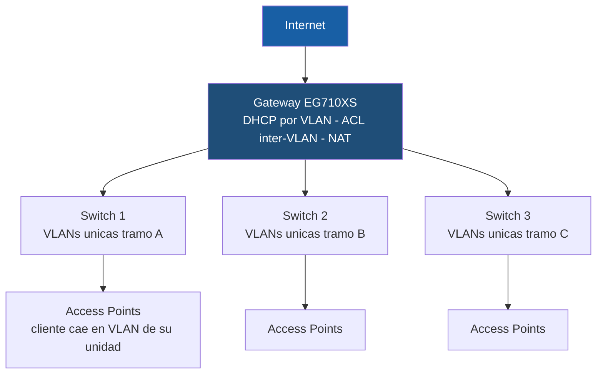
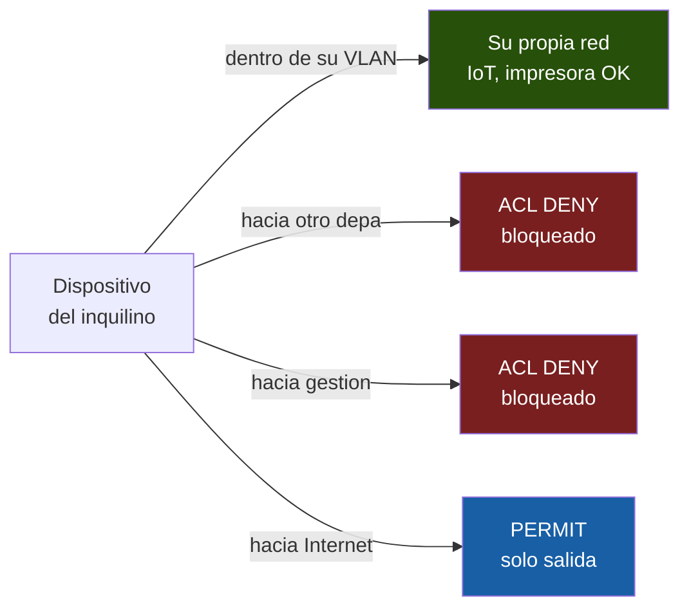
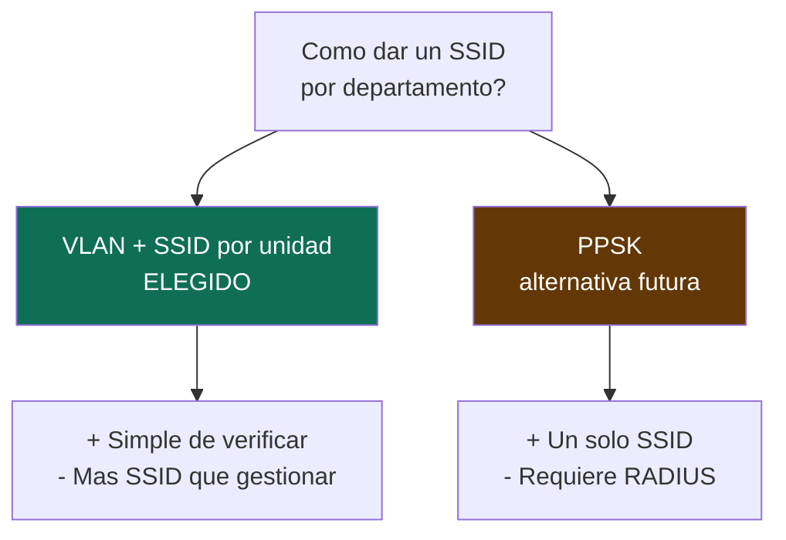
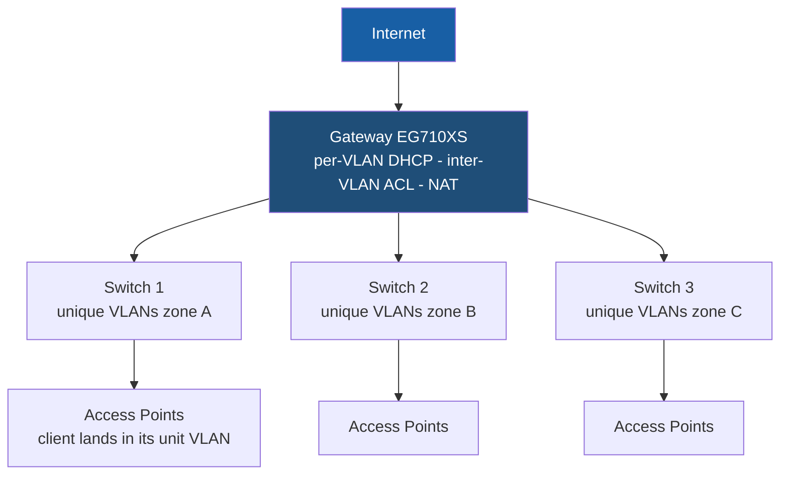
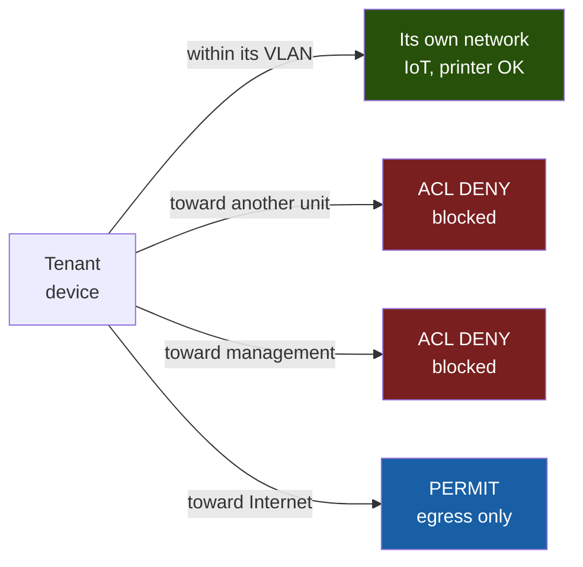

# 🏢 Segmentación de Red Segura para Edificio Multi‑Inquilino (45 unidades)
### Secure Network Segmentation for a Multi‑Tenant Building (45 units)

> Diseño y configuración de una red Wi‑Fi segmentada por inquilino para un edificio de departamentos de estudiantes, con aislamiento L2/L3, control de acceso inter‑VLAN y endurecimiento siguiendo el principio de mínimo privilegio.
>
> *Design and configuration of a per‑tenant segmented Wi‑Fi network for a student housing building, featuring L2/L3 isolation, inter‑VLAN access control, and least‑privilege hardening.*

---

## 🇪🇸 Español

### Resumen del proyecto
Diseñé y configuré desde cero la red de un edificio de **45 departamentos** (zona universitaria) sobre equipo **Ruijie Reyee** (1 gateway, 3 switches gestionados, 44 access points). El objetivo central fue de **ciberseguridad**: garantizar que cada inquilino quede **aislado** de los demás, manteniendo a la vez utilizable su propia red interna (TV, impresora, dispositivos IoT).

> ⚠️ **Nota:** Todos los datos sensibles (contraseñas, seriales, nombre del cliente, IPs públicas) han sido **anonimizados o sustituidos por valores de ejemplo**. Este repositorio documenta el **diseño y el criterio técnico**, no credenciales reales.

### Rol
**Diseño de red y configuración / Network & Security Engineering.** El cableado estructurado, rack y montaje físico fueron realizados por un tercero; mi aporte fue el **diseño lógico, la segmentación, la seguridad y la documentación**.

### Objetivos de seguridad
- **Aislamiento por inquilino:** ningún departamento puede alcanzar a otro (mismo piso u otro piso).
- **Servicios internos preservados:** dentro de cada unidad, los dispositivos del inquilino sí se comunican entre sí (requisito para IoT/impresión).
- **Salida controlada:** cada unidad solo accede a Internet; nunca a la red de gestión ni a otras unidades.
- **Mínimo privilegio:** cada segmento expone únicamente lo estrictamente necesario.

---

### 🗺️ Arquitectura

| Capa | Elemento | Función de seguridad |
|------|----------|----------------------|
| L3 / Borde | Gateway (router) | Ruteo, DHCP por segmento, **ACL inter‑VLAN**, NAT a Internet |
| L2 / Distribución | 3 switches gestionados | Transporte de VLAN, troncales 802.1Q, segmentación |
| Acceso | 44 access points | Difusión de SSID por unidad, asignación de cliente a su VLAN |

### Esquema de segmentación
- **45 VLAN únicas**, una por unidad (IDs no reutilizados entre switches para evitar colisiones de dominio de difusión).
- **Una subred /24 por VLAN** → direccionamiento legible (la IP identifica la unidad).
- **VLAN de gestión dedicada y separada** del tráfico de inquilinos.

---

### 🔒 Modelo de aislamiento

| Escenario | Mecanismo | Capa |
|-----------|-----------|------|
| Dentro de la unidad (IoT debe funcionar) | Sin client isolation; comunicación libre dentro de la VLAN | L2 |
| Entre unidades | Subredes distintas + **ACL deny** entre VLAN de inquilinos | L3 |
| Hacia gestión | ACL que **bloquea** el acceso de las VLAN de inquilino a la VLAN de gestión | L3 |
| Hacia Internet | **Permit** únicamente VLAN de inquilino → WAN | L3 |

---

### 🧠 Decisiones técnicas y trade‑offs

Esta sección documenta el **razonamiento**, que es donde está el valor de ingeniería.

1. **VLAN por unidad vs. VLAN por piso.**
   Una VLAN por piso (subred compartida) hacía frágil el aislamiento entre vecinos del mismo piso y dependía de difusión/descubrimiento. Se optó por **VLAN por unidad**: aislamiento robusto a nivel de subred, sin trucos.

2. **Client Isolation incompatible con IoT.**
   El *client isolation* a nivel SSID aísla **todos** los clientes del SSID entre sí, lo que **rompería** que el teléfono del inquilino vea su propia impresora/TV. Decisión: **no** usar client isolation y mover el aislamiento al límite de la **VLAN**.

3. **Límites de la plataforma de gestión (grupos/SSID).**
   La gestión en nube imponía un tope de grupos de AP y de SSID por grupo. Se rediseñó el reparto de SSID entendiendo que **el aislamiento lo da la VLAN, no el grupo**.

4. **Endurecimiento de troncales (mínimo privilegio).**
   Los puertos de AP deben permitir **solo las VLAN necesarias**, reduciendo la superficie ante un AP comprometido y dificultando el *VLAN hopping*.

5. **Protección de la VLAN de gestión.**
   Si un inquilino alcanza la interfaz de gestión, podría intentar comprometer un AP. Mitigación: **ACL que aísla la VLAN de gestión**, contraseñas robustas y firmware actualizado.

---

### 🛡️ Análisis de amenazas

| Amenaza | Vector | Mitigación aplicada |
|---------|--------|---------------------|
| VLAN hopping | Puerto troncal con todas las VLAN | Mínimo privilegio por puerto; cliente Wi‑Fi no etiqueta 802.1Q en modo bridge |
| Movimiento lateral entre inquilinos | Ruteo inter‑VLAN | ACL deny entre VLAN de inquilinos |
| Compromiso de equipo de red | Acceso a VLAN de gestión | Aislamiento de gestión, credenciales fuertes, firmware al día |
| Rogue DHCP / ARP spoofing | Cliente malicioso en su VLAN | DHCP Snooping / ARP Guard recomendados a nivel de switch |

---

### ⚖️ Trade‑offs y mejoras futuras

- **VLAN por unidad vs. PPSK.** PPSK (un solo SSID con clave por inquilino que asigna VLAN automáticamente) habría evitado los límites de grupos/SSID. Se eligió VLAN+SSID por simplicidad de verificación; la variante enterprise de PPSK suele requerir RADIUS. **Mejora futura:** evaluar PPSK.
- **Tamaño de subred (/24).** Elegido por legibilidad; un `/27` o `/28` sería más eficiente. Se priorizó claridad operativa sobre densidad de direccionamiento.
- **Aislamiento centralizado en el gateway.** Punto único de fallo para la segmentación; un entorno crítico requeriría redundancia (HA).
- **Hardening de troncales — pendiente de afinar.** Restringir las VLAN permitidas por puerto donde quedaron como troncal completo.
- **Detección, no solo prevención.** Una evolución añadiría logging centralizado, monitoreo de tráfico anómalo o IDS/IPS, y 802.1X para acceso cableado.

> El objetivo no es señalar fallos, sino mostrar que las decisiones fueron **conscientes** y que existe un camino claro de evolución.

---

### 🧰 Habilidades demostradas
`VLAN 802.1Q` · `Segmentación de red` · `ACL / Control de acceso inter‑VLAN` · `Diseño de direccionamiento IP` · `Arquitectura Wi‑Fi multi‑SSID` · `Principio de mínimo privilegio` · `Modelado de amenazas` · `Hardening` · `Ruijie Reyee` · `Documentación técnica`

---
---

## 🇬🇧 English

### Project overview
I designed and configured, from the ground up, the network for a **45‑unit residential building** (student housing) on **Ruijie Reyee** hardware (1 gateway, 3 managed switches, 44 access points). The core goal was **security**: ensuring every tenant is **isolated** from the others while keeping each tenant's own internal network usable (smart TV, printer, IoT devices).

> ⚠️ **Note:** All sensitive data (passwords, serial numbers, client name, public IPs) has been **anonymized or replaced with sample values**. This repository documents **design and technical reasoning**, not real credentials.

### Role
**Network design & security engineering.** Structured cabling, rack and physical mounting were done by a third party; my contribution was the **logical design, segmentation, security and documentation.**

### Security objectives
- **Per‑tenant isolation:** no unit can reach another (same floor or different floor).
- **Internal services preserved:** within a unit, the tenant's devices can talk to each other (required for IoT/printing).
- **Controlled egress:** each unit reaches the Internet only — never the management network nor other units.
- **Least privilege:** each segment exposes strictly what it needs.

---

### 🗺️ Architecture

| Layer | Element | Security function |
|-------|---------|-------------------|
| L3 / Edge | Gateway (router) | Routing, per‑segment DHCP, **inter‑VLAN ACL**, NAT to Internet |
| L2 / Distribution | 3 managed switches | VLAN transport, 802.1Q trunks, segmentation |
| Access | 44 access points | Per‑unit SSID broadcast, client‑to‑VLAN assignment |

### Segmentation scheme
- **45 unique VLANs**, one per unit (IDs not reused across switches to avoid broadcast‑domain collisions).
- **One /24 subnet per VLAN** → human‑readable addressing (the IP identifies the unit).
- **Dedicated management VLAN**, separated from tenant traffic.

---

### 🔒 Isolation model

| Scenario | Mechanism | Layer |
|----------|-----------|-------|
| Inside the unit (IoT must work) | No client isolation; free comms within the VLAN | L2 |
| Between units | Distinct subnets + **deny ACL** between tenant VLANs | L3 |
| Toward management | ACL **blocks** tenant VLANs from the management VLAN | L3 |
| Toward Internet | **Permit** tenant VLAN → WAN only | L3 |

---

### 🧠 Key technical decisions & trade‑offs

1. **Per‑unit VLAN vs. per‑floor VLAN.** A shared per‑floor subnet made same‑floor isolation fragile and discovery‑dependent. Chose **per‑unit VLANs** for robust subnet‑level isolation.
2. **Client isolation breaks IoT.** SSID‑level client isolation separates *all* clients, which would stop a tenant's phone from reaching their own printer/TV. Decision: enforce isolation at the **VLAN** boundary instead.
3. **Cloud management limits (groups/SSIDs).** The platform capped AP groups and SSIDs per group. SSID distribution was redesigned so that **isolation comes from the VLAN, not the grouping**.
4. **Trunk hardening (least privilege).** AP ports should permit **only required VLANs**, shrinking the blast radius of a compromised AP and hardening against **VLAN hopping**.
5. **Management VLAN protection.** If a tenant reaches the management interface, they could attempt to compromise an AP. Mitigation: **ACL isolating the management VLAN**, strong admin passwords, up‑to‑date firmware.

---

### 🛡️ Threat analysis

| Threat | Vector | Mitigation |
|--------|--------|------------|
| VLAN hopping | Trunk port carrying all VLANs | Per‑port least privilege; Wi‑Fi client can't tag 802.1Q in bridge mode |
| Lateral movement between tenants | Inter‑VLAN routing | Deny ACL between tenant VLANs |
| Network device compromise | Access to management VLAN | Management isolation, strong creds, firmware updates |
| Rogue DHCP / ARP spoofing | Malicious client in its VLAN | DHCP Snooping / ARP Guard recommended at switch level |

---

### ⚖️ Trade‑offs & future improvements

- **Per‑unit VLAN vs. PPSK.** PPSK (one SSID, per‑tenant password auto‑assigning VLAN) would have avoided the group/SSID limits. Chose VLAN+SSID for verification simplicity; enterprise PPSK typically needs RADIUS. **Future:** evaluate PPSK.
- **Subnet size (/24).** Chosen for readability; a `/27` or `/28` would be more efficient. Operational clarity prioritized over addressing density.
- **Centralized isolation at the gateway.** Single point of failure for segmentation; a critical environment would need redundancy (HA).
- **Trunk hardening — to be refined.** Restrict allowed VLANs per port where ports remained full trunks.
- **Detection, not just prevention.** A natural evolution adds centralized logging, anomalous‑traffic monitoring or IDS/IPS, and 802.1X for wired access.

> The goal isn't to point out flaws, but to show the decisions were **deliberate** with a clear evolution path.

---

### 🧰 Skills demonstrated
`802.1Q VLANs` · `Network segmentation` · `ACL / inter‑VLAN access control` · `IP addressing design` · `Multi‑SSID Wi‑Fi architecture` · `Least‑privilege principle` · `Threat modeling` · `Hardening` · `Ruijie Reyee` · `Technical documentation`
